# Algorithm diagrams (Mermaid)

Flowcharts for the algorithms described in [`ALGORITHMS.md`](ALGORITHMS.md).
All randomness is seeded (`numpy.random.default_rng`).

---

## The core update: `step()`

The one rule every simulation iterates.

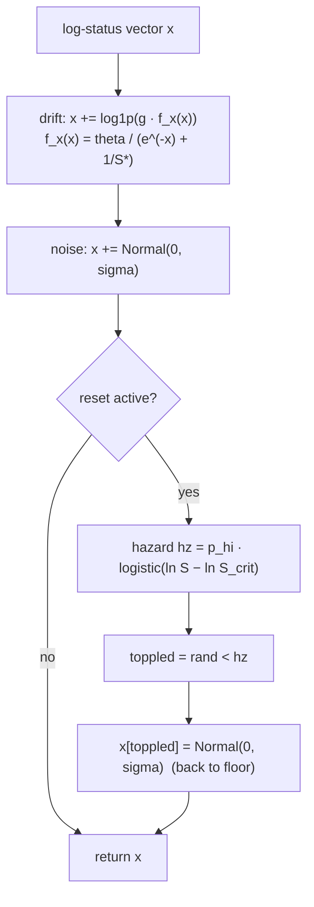
```mermaid
flowchart TD
    A["log-status vector x"] --> B["drift: x += log1p(g · f_x(x))<br/>f_x(x) = theta / (e^(-x) + 1/S*)"]
    B --> C["noise: x += Normal(0, sigma)"]
    C --> D{"reset active?"}
    D -- no --> E["return x"]
    D -- yes --> F["hazard hz = p_hi · logistic(ln S − ln S_crit)"]
    F --> G["toppled = rand < hz"]
    G --> H["x[toppled] = Normal(0, sigma)  (back to floor)"]
    H --> E
```

---

## E1: symmetry breaking and A(g)

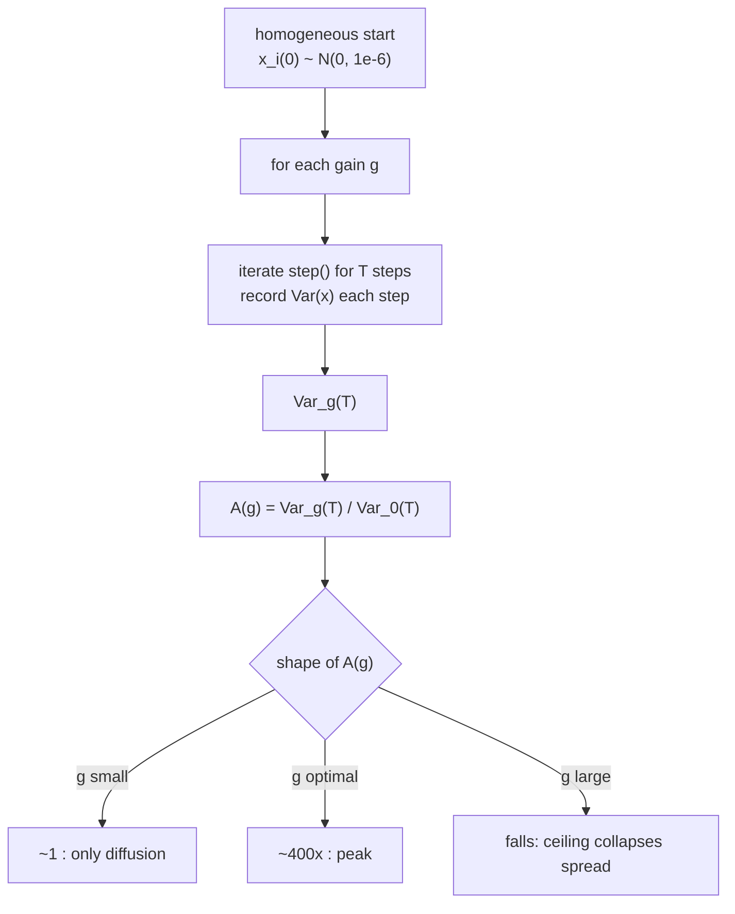
```mermaid
flowchart TD
    A["homogeneous start<br/>x_i(0) ~ N(0, 1e-6)"] --> B["for each gain g"]
    B --> C["iterate step() for T steps<br/>record Var(x) each step"]
    C --> D["Var_g(T)"]
    D --> E["A(g) = Var_g(T) / Var_0(T)"]
    E --> F{"shape of A(g)"}
    F -->|"g small"| G["~1 : only diffusion"]
    F -->|"g optimal"| H["~400x : peak"]
    F -->|"g large"| I["falls: ceiling collapses spread"]
```

---

## Optimal gain g\*

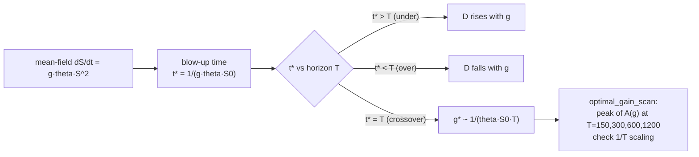
```mermaid
flowchart LR
    A["mean-field dS/dt = g·theta·S^2"] --> B["blow-up time<br/>t* = 1/(g·theta·S0)"]
    B --> C{"t* vs horizon T"}
    C -->|"t* > T (under)"| D["D rises with g"]
    C -->|"t* < T (over)"| E["D falls with g"]
    C -->|"t* = T (crossover)"| F["g* ~ 1/(theta·S0·T)"]
    F --> G["optimal_gain_scan:<br/>peak of A(g) at T=150,300,600,1200<br/>check 1/T scaling"]
```

---

## E2: direction vs correctness

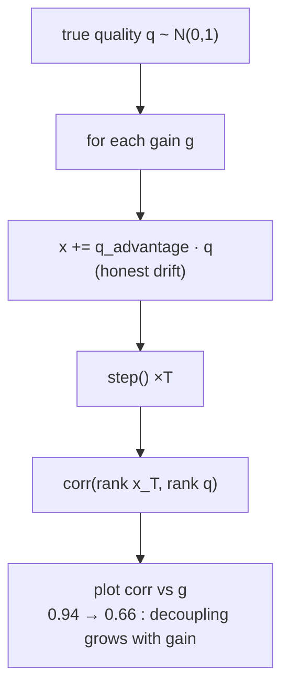
```mermaid
flowchart TD
    A["true quality q ~ N(0,1)"] --> B["for each gain g"]
    B --> C["x += q_advantage · q  (honest drift)"]
    C --> D["step()  ×T"]
    D --> E["corr(rank x_T, rank q)"]
    E --> F["plot corr vs g<br/>0.94 → 0.66 : decoupling grows with gain"]
```

---

## E3: ergodicity and dead ends

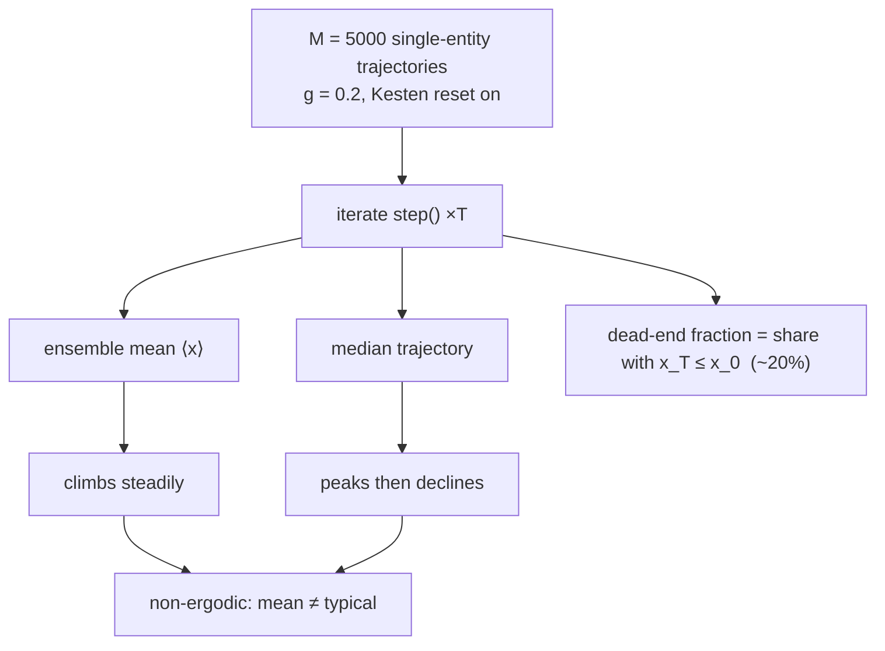
```mermaid
flowchart TD
    A["M = 5000 single-entity trajectories<br/>g = 0.2, Kesten reset on"] --> B["iterate step() ×T"]
    B --> C["ensemble mean ⟨x⟩"]
    B --> D["median trajectory"]
    C --> E["climbs steadily"]
    D --> F["peaks then declines"]
    E & F --> G["non-ergodic: mean ≠ typical"]
    B --> H["dead-end fraction = share with x_T ≤ x_0  (~20%)"]
```

---

## E4: amplification necessary for development

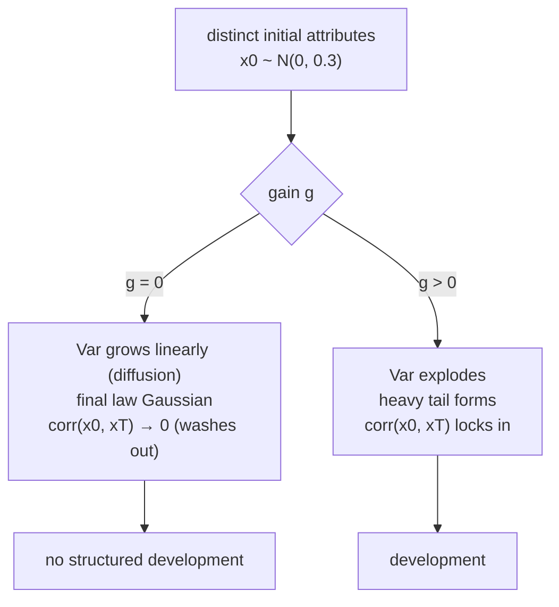
```mermaid
flowchart TD
    A["distinct initial attributes<br/>x0 ~ N(0, 0.3)"] --> B{"gain g"}
    B -->|"g = 0"| C["Var grows linearly (diffusion)<br/>final law Gaussian<br/>corr(x0, xT) → 0 (washes out)"]
    B -->|"g > 0"| D["Var explodes<br/>heavy tail forms<br/>corr(x0, xT) locks in"]
    C --> E["no structured development"]
    D --> F["development"]
```

---

## Scope: manufactured vs inherited (`scale_scan`)

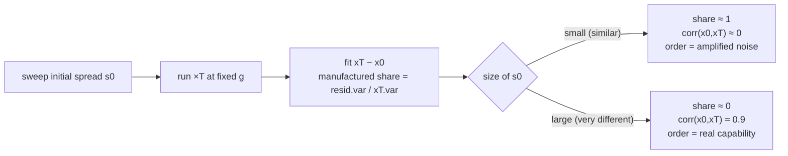
```mermaid
flowchart LR
    A["sweep initial spread s0"] --> B["run ×T at fixed g"]
    B --> C["fit xT ~ x0<br/>manufactured share = resid.var / xT.var"]
    C --> D{"size of s0"}
    D -->|"small (similar)"| E["share ≈ 1<br/>corr(x0,xT) ≈ 0<br/>order = amplified noise"]
    D -->|"large (very different)"| F["share ≈ 0<br/>corr(x0,xT) ≈ 0.9<br/>order = real capability"]
```

---

## Early-lead persistence: capability-free (simulation)

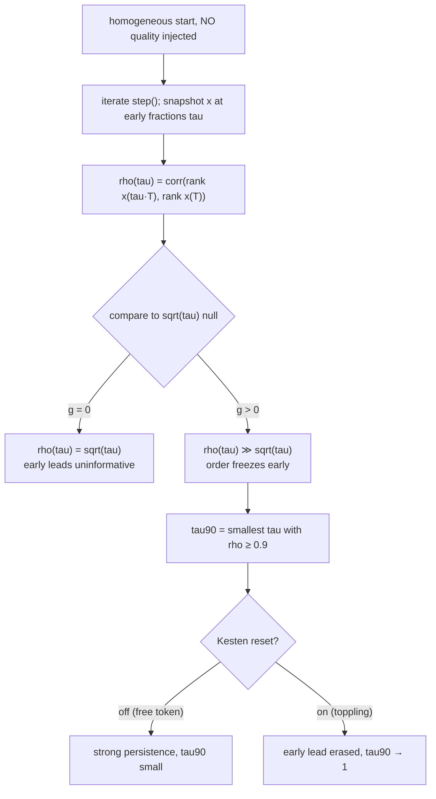
```mermaid
flowchart TD
    A["homogeneous start, NO quality injected"] --> B["iterate step(); snapshot x at early fractions tau"]
    B --> C["rho(tau) = corr(rank x(tau·T), rank x(T))"]
    C --> D{"compare to sqrt(tau) null"}
    D -->|"g = 0"| E["rho(tau) = sqrt(tau)<br/>early leads uninformative"]
    D -->|"g > 0"| F["rho(tau) ≫ sqrt(tau)<br/>order freezes early"]
    F --> G["tau90 = smallest tau with rho ≥ 0.9"]
    G --> H{"Kesten reset?"}
    H -->|"off (free token)"| I["strong persistence, tau90 small"]
    H -->|"on (toppling)"| J["early lead erased, tau90 → 1"]
```

---

## PA-null and the toppling discriminator (`earlylead_pa_null.py`)

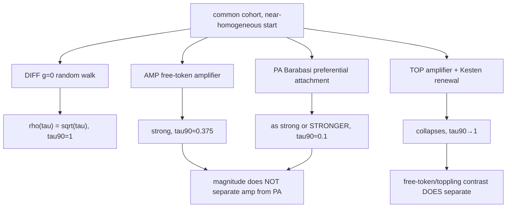
```mermaid
flowchart TD
    A["common cohort, near-homogeneous start"] --> B["DIFF g=0 random walk"]
    A --> C["AMP free-token amplifier"]
    A --> D["PA Barabasi preferential attachment"]
    A --> E["TOP amplifier + Kesten renewal"]
    B --> F["rho(tau) = sqrt(tau), tau90=1"]
    C --> G["strong, tau90≈0.375"]
    D --> H["as strong or STRONGER, tau90≈0.1"]
    E --> I["collapses, tau90→1"]
    G & H --> J["magnitude does NOT separate amp from PA"]
    I --> K["free-token/toppling contrast DOES separate"]
```

---

## Emergent ceiling (`regulation.py`)

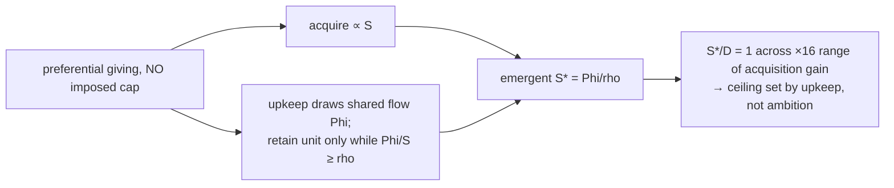
```mermaid
flowchart LR
    A["preferential giving, NO imposed cap"] --> B["acquire ∝ S"]
    A --> C["upkeep draws shared flow Phi;<br/>retain unit only while Phi/S ≥ rho"]
    B & C --> D["emergent S* = Phi/rho"]
    D --> E["S*/D = 1 across ×16 range of acquisition gain<br/>→ ceiling set by upkeep, not ambition"]
```

---

## Lower threshold: buffer asymmetry (`critical_threshold.py`)

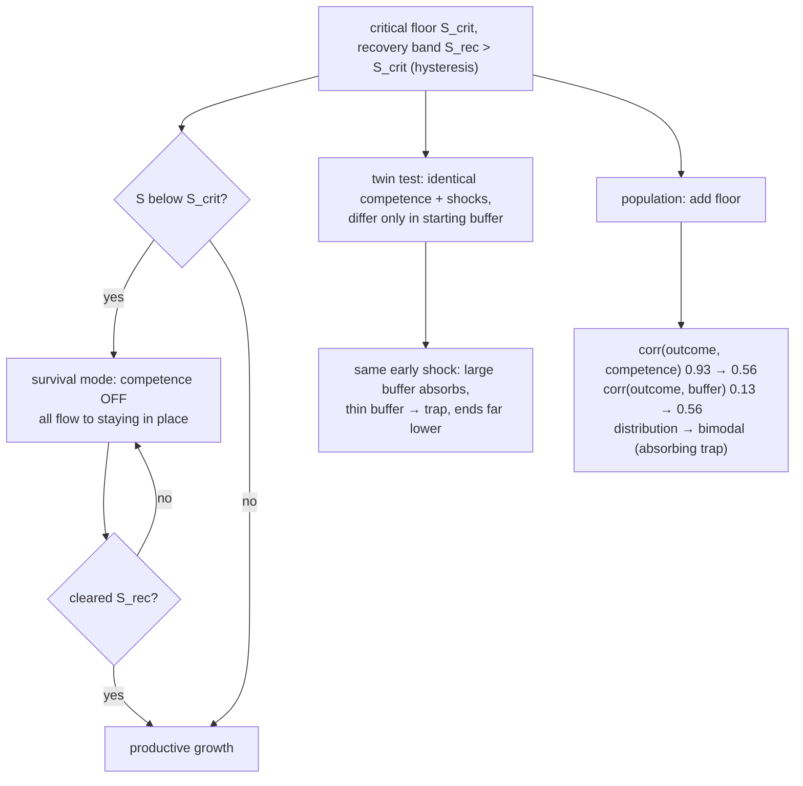
```mermaid
flowchart TD
    A["critical floor S_crit, recovery band S_rec > S_crit (hysteresis)"] --> B{"S below S_crit?"}
    B -->|"yes"| C["survival mode: competence OFF<br/>all flow to staying in place"]
    B -->|"no"| D["productive growth"]
    C --> E{"cleared S_rec?"}
    E -->|"no"| C
    E -->|"yes"| D
    A --> F["twin test: identical competence + shocks,<br/>differ only in starting buffer"]
    F --> G["same early shock: large buffer absorbs,<br/>thin buffer → trap, ends far lower"]
    A --> H["population: add floor"]
    H --> I["corr(outcome, competence) 0.93 → 0.56<br/>corr(outcome, buffer) 0.13 → 0.56<br/>distribution → bimodal (absorbing trap)"]
```

---

## Joint dose-response fingerprint (`dose_response.py`)

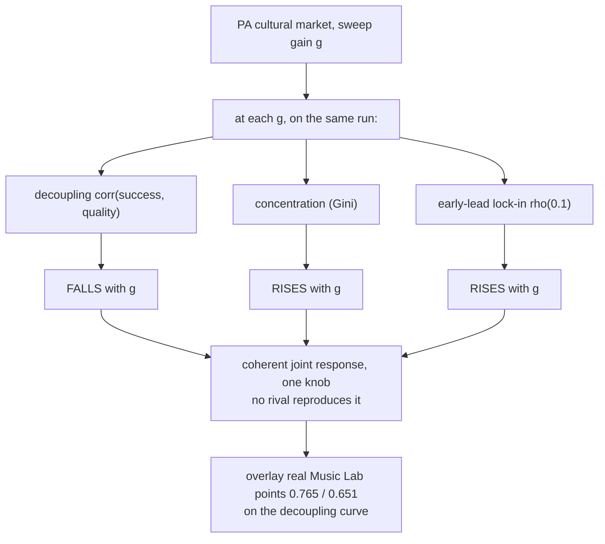
```mermaid
flowchart TD
    A["PA cultural market, sweep gain g"] --> B["at each g, on the same run:"]
    B --> C["decoupling corr(success, quality)"]
    B --> D["concentration (Gini)"]
    B --> E["early-lead lock-in rho(0.1)"]
    C --> F["FALLS with g"]
    D --> G["RISES with g"]
    E --> H["RISES with g"]
    F & G & H --> I["coherent joint response, one knob<br/>no rival reproduces it"]
    I --> J["overlay real Music Lab points 0.765 / 0.651<br/>on the decoupling curve"]
```

---

## Design 1 real data: Music Lab decoupling (`musiclab_analysis.py`)

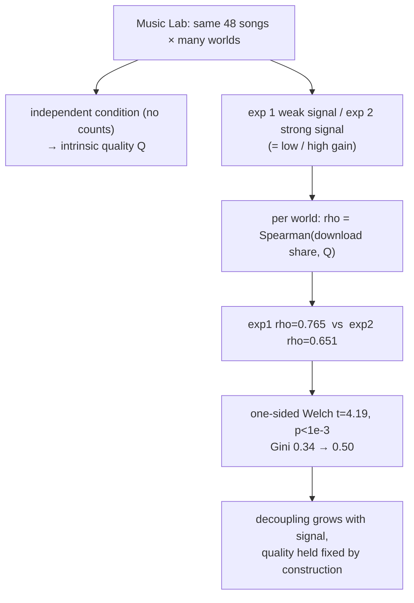
```mermaid
flowchart TD
    A["Music Lab: same 48 songs × many worlds"] --> B["independent condition (no counts)<br/>→ intrinsic quality Q"]
    A --> C["exp 1 weak signal / exp 2 strong signal<br/>(= low / high gain)"]
    C --> D["per world: rho = Spearman(download share, Q)"]
    D --> E["exp1 rho=0.765  vs  exp2 rho=0.651"]
    E --> F["one-sided Welch t=4.19, p<1e-3<br/>Gini 0.34 → 0.50"]
    F --> G["decoupling grows with signal,<br/>quality held fixed by construction"]
```

---

## Monte-Carlo power analysis (`power_analysis.py`)

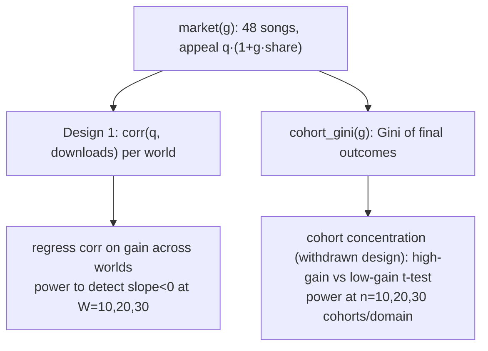
```mermaid
flowchart TD
    A["market(g): 48 songs, appeal q·(1+g·share)"] --> B["Design 1: corr(q, downloads) per world"]
    B --> C["regress corr on gain across worlds<br/>power to detect slope<0 at W=10,20,30"]
    A --> D["cohort_gini(g): Gini of final outcomes"]
    D --> E["cohort concentration (withdrawn design): high-gain vs low-gain t-test<br/>power at n=10,20,30 cohorts/domain"]
```

---

## Design 2 real data: toppling arm (`wiki_rfa_toppling.py`, `--online`)

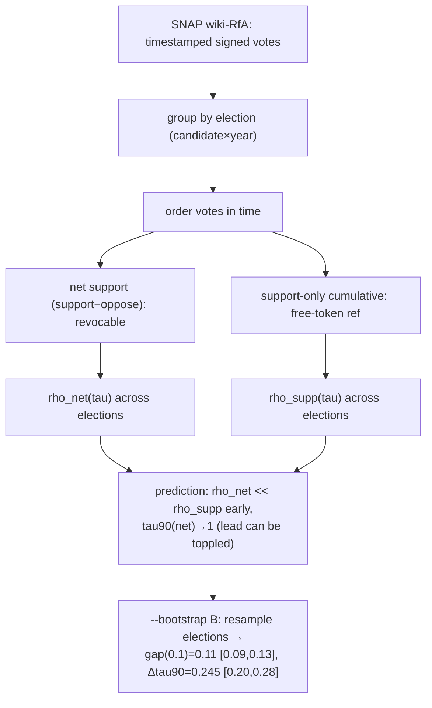
```mermaid
flowchart TD
    A["SNAP wiki-RfA: timestamped signed votes"] --> B["group by election (candidate×year)"]
    B --> C["order votes in time"]
    C --> D["net support (support−oppose): revocable"]
    C --> E["support-only cumulative: free-token ref"]
    D --> F["rho_net(tau) across elections"]
    E --> G["rho_supp(tau) across elections"]
    F & G --> H["prediction: rho_net << rho_supp early,<br/>tau90(net)→1 (lead can be toppled)"]
    H --> I["--bootstrap B: resample elections →<br/>gap(0.1)=0.11 [0.09,0.13], Δtau90=0.245 [0.20,0.28]"]
```

---

## Design 2 real data: free-token arm (`github_earlylead.py`, `--online`)

```mermaid
flowchart LR
    A["Search API: repos created:<window>"] --> B["cohort, all start at 0 stars"]
    B --> C["stargazers starred_at timestamps<br/>(cached; needs GITHUB_TOKEN)"]
    C --> D["cumulative star stock at each tau"]
    D --> E["rho(tau), tau90 (Spearman)"]
    E --> F["vs sqrt(tau) null AND PA null<br/>predict strong persistence (free token)"]
```

---

## Test B, simulation: the rho(tau) collapse (`data_collapse.py`)

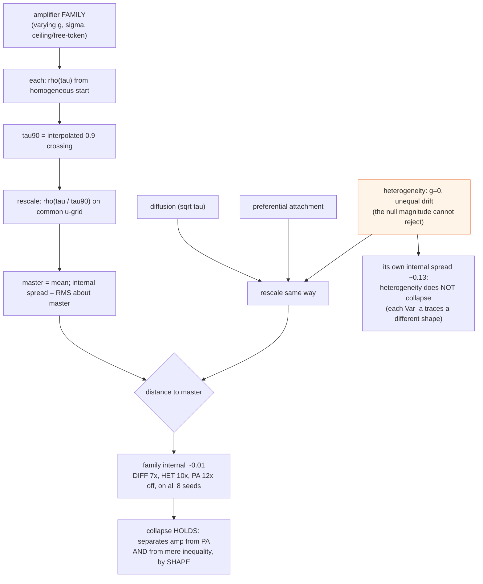
```mermaid
flowchart TD
    A["amplifier FAMILY<br/>(varying g, sigma, ceiling/free-token)"] --> B["each: rho(tau) from homogeneous start"]
    B --> C["tau90 = interpolated 0.9 crossing"]
    C --> D["rescale: rho(tau / tau90) on common u-grid"]
    D --> E["master = mean; internal spread = RMS about master"]
    F["diffusion (sqrt tau)"] --> G["rescale same way"]
    H["preferential attachment"] --> G
    HET["heterogeneity: g=0, unequal drift<br/>(the null magnitude cannot reject)"] --> G
    G --> I{"distance to master"}
    E --> I
    I --> J["family internal ~0.01<br/>DIFF 7x, HET 10x, PA 12x off, on all 8 seeds"]
    J --> K["collapse HOLDS: separates amp from PA<br/>AND from mere inequality, by SHAPE"]
    HET --> L["its own internal spread ~0.13:<br/>heterogeneity does NOT collapse<br/>(each Var_a traces a different shape)"]
    style HET fill:#fff4e8,stroke:#ea580c
```

---

## Test B, real data: three free-token domains (`real_data_collapse.py`)

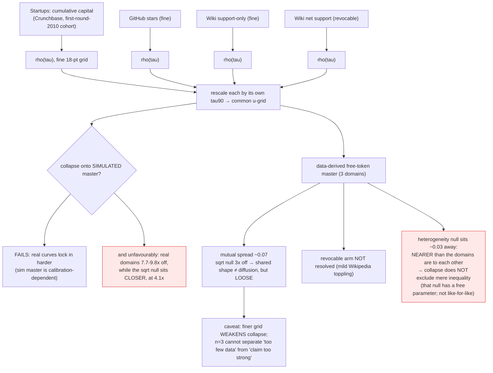
```mermaid
flowchart TD
    S["Startups: cumulative capital<br/>(Crunchbase, first-round-2010 cohort)"] --> R1["rho(tau), fine 18-pt grid"]
    G["GitHub stars (fine)"] --> R2["rho(tau)"]
    W["Wiki support-only (fine)"] --> R3["rho(tau)"]
    N["Wiki net support (revocable)"] --> R4["rho(tau)"]
    R1 & R2 & R3 & R4 --> RS["rescale each by its own tau90 → common u-grid"]
    RS --> M1{"collapse onto SIMULATED master?"}
    M1 --> F1["FAILS: real curves lock in harder<br/>(sim master is calibration-dependent)"]
    M1 --> F1b["and unfavourably: real domains 7.7-9.8x off,<br/>while the sqrt null sits CLOSER, at 4.1x"]
    RS --> M2["data-derived free-token master (3 domains)"]
    M2 --> F2["mutual spread ~0.07<br/>sqrt null 3x off → shared shape ≠ diffusion, but LOOSE"]
    M2 --> F3["revocable arm NOT resolved (mild Wikipedia toppling)"]
    M2 --> F4["heterogeneity null sits ~0.03 away:<br/>NEARER than the domains are to each other<br/>→ collapse does NOT exclude mere inequality<br/>(that null has a free parameter; not like-for-like)"]
    F2 --> C["caveat: finer grid WEAKENS collapse;<br/>n=3 cannot separate 'too few data' from 'claim too strong'"]
    style F1b fill:#ffe8e8,stroke:#dc2626
    style F4 fill:#ffe8e8,stroke:#dc2626
```

---

## Non-identifiability worked example (`lichess_worked_example.py`, `--lichess`)

The boundary between A and B on real data. Note that BOTH trajectory appearances
fail here; only the exogenous channel settles anything.

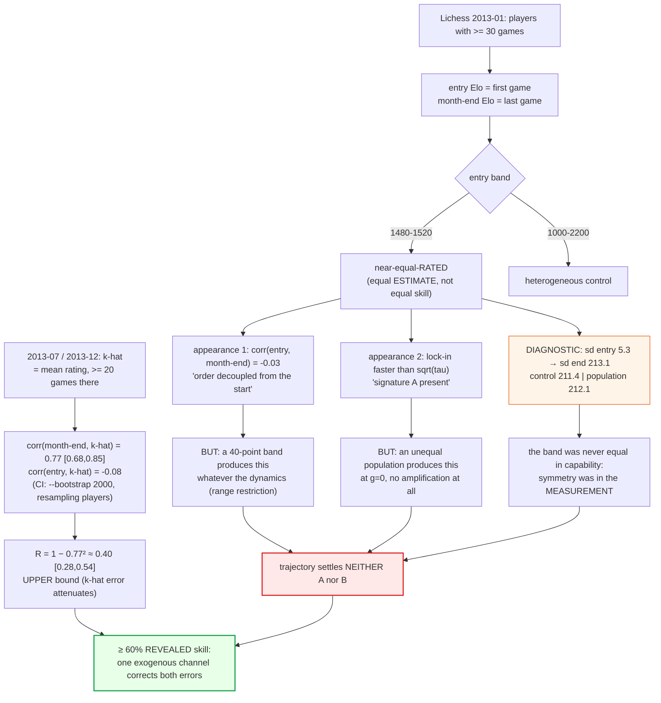
```mermaid
flowchart TD
    A["Lichess 2013-01: players with >= 30 games"] --> B["entry Elo = first game<br/>month-end Elo = last game"]
    B --> C{"entry band"}
    C -->|"1480-1520"| D["near-equal-RATED<br/>(equal ESTIMATE, not equal skill)"]
    C -->|"1000-2200"| E["heterogeneous control"]
    D --> F["appearance 1: corr(entry, month-end) = -0.03<br/>'order decoupled from the start'"]
    D --> G["appearance 2: lock-in faster than sqrt(tau)<br/>'signature A present'"]
    F --> H["BUT: a 40-point band produces this<br/>whatever the dynamics (range restriction)"]
    G --> I["BUT: an unequal population produces this<br/>at g=0, no amplification at all"]
    D --> J["DIAGNOSTIC: sd entry 5.3 → sd end 213.1<br/>control 211.4 | population 212.1"]
    J --> K["the band was never equal in capability:<br/>symmetry was in the MEASUREMENT"]
    H & I & K --> L["trajectory settles NEITHER A nor B"]
    M["2013-07 / 2013-12: k-hat<br/>= mean rating, >= 20 games there"] --> N["corr(month-end, k-hat) = 0.77 [0.68,0.85]<br/>corr(entry, k-hat) = -0.08<br/>(CI: --bootstrap 2000, resampling players)"]
    N --> O["R = 1 − 0.77² ≈ 0.40 [0.28,0.54]<br/>UPPER bound (k-hat error attenuates)"]
    O --> P["≥ 60% REVEALED skill:<br/>one exogenous channel corrects both errors"]
    L --> P
    style L fill:#ffe8e8,stroke:#dc2626,stroke-width:2px
    style P fill:#e8ffe8,stroke:#16a34a,stroke-width:2px
    style J fill:#fff4e8,stroke:#ea580c
```

---

## Fine-grid re-extraction (`refine_grids.py`)

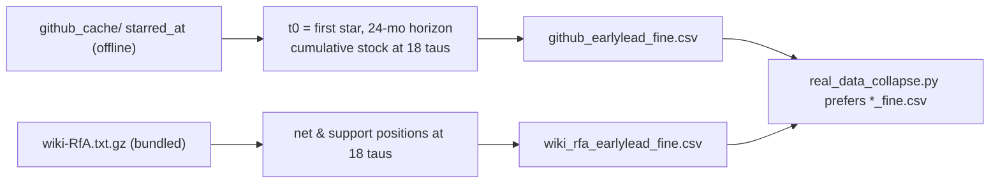
```mermaid
flowchart LR
    A["github_cache/ starred_at (offline)"] --> B["t0 = first star, 24-mo horizon<br/>cumulative stock at 18 taus"]
    B --> C["github_earlylead_fine.csv"]
    D["wiki-RfA.txt.gz (bundled)"] --> E["net & support positions at 18 taus"]
    E --> F["wiki_rfa_earlylead_fine.csv"]
    C & F --> G["real_data_collapse.py prefers *_fine.csv"]
```
